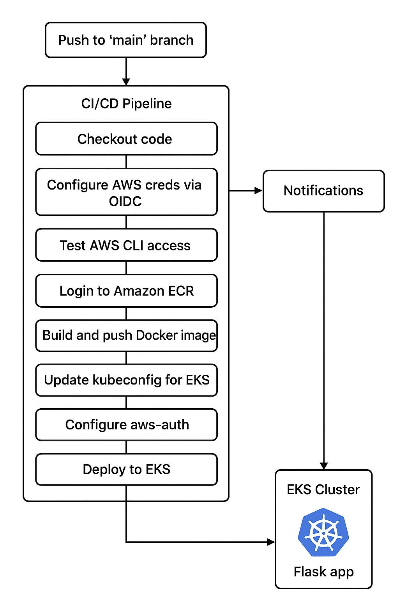
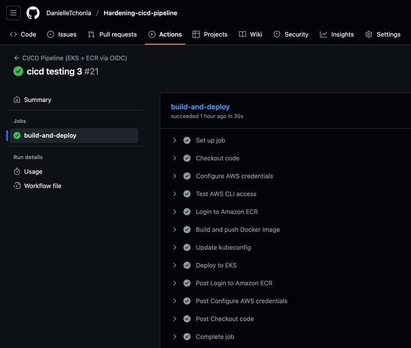

# Hardened CI/CD Pipeline for EKS + ECR via OIDC

This repository demonstrates a **secure and resilient CI/CD pipeline** using GitHub Actions, AWS EKS, and ECR. The pipeline follows best practices for cloud-native deployments and includes hardened features such as retries, notifications, parallel stages, Docker caching, and failure simulation.

---

### Features
- GitHub Actions workflow triggered on `main` branch
- AWS OIDC-based authentication (no static credentials)
- Docker image build and push to ECR
- Deployment to EKS using `kubectl`
- Namespace management in Kubernetes
- Pipeline hardening:
  - Stage-level retry logic
  - Slack / webhook notifications
  - Parallel stages
  - Docker layer caching
  - Failure simulation to test resilience

---

## Prerequisites

- AWS Account with appropriate IAM roles for OIDC:
  - `GitHubActionsRole` with `sts:AssumeRoleWithWebIdentity`
  - Worker node role with EKS policies
- GitHub repository with Actions enabled
- EKS cluster deployed
- Docker installed on GitHub runner
- `kubectl` available on runner

---

## Workflow Overview

The pipeline is triggered on pushes to the `main` branch and performs the following steps:

1. **Create Kubernetes Namespace**  
   Ensures a dedicated namespace exists for deployment.

2. **Checkout Code**  
   Retrieves the repository source code and Kubernetes manifests.

3. **Configure AWS Credentials via OIDC**  
   Uses GitHub OIDC provider for short-lived, secure credentials.

4. **Test AWS Access**  
   Confirms that the GitHub Actions role can assume AWS permissions:
   ```bash
   aws sts get-caller-identity



Kubernetes Access Configuration

Apply aws-auth ConfigMap
Allows EC2 worker nodes and GitHub Actions OIDC role to access the cluster:

kubectl apply -f eks/configmap.yml


Verify access

kubectl get nodes
kubectl get pods -n Hardening-namespace


Troubleshooting

You must be logged in to the server
Ensure your kubeconfig is updated:

aws eks update-kubeconfig --region $AWS_REGION --name cicd-cluster


deployment not found
Ensure your deployment name in the workflow matches the manifest (flask-app) and namespace exists.

Pipeline Hardening Details

Stage-level retry logic

Automatically retries failed steps to handle transient errors

Example (GitHub Actions retry):

- name: Build and push Docker image
  run: |
    docker build -t $ECR_REPOSITORY:$IMAGE_TAG .
    docker push ${{ steps.ecr-login.outputs.registry }}/$ECR_REPOSITORY:$IMAGE_TAG
  retry: 2


Slack / Webhook notifications

Sends success or failure notifications

Example GitHub Actions webhook:

- name: Notify Slack
  uses: slackapi/slack-github-action@v1
  with:
    channel-id: 'C0123456789'
    slack-message: 'Deployment to EKS completed successfully'
    status: ${{ job.status }}
    slack-bot-token: ${{ secrets.SLACK_BOT_TOKEN }}


Parallel stages

Run independent tasks (e.g., linting, tests, security scans) simultaneously

Speeds up pipeline execution

Docker layer caching

Use GitHub Actions cache or --cache-from to reuse layers and speed up builds

Example:

- name: Build Docker image with cache
  run: docker build --cache-from ${{ steps.ecr-login.outputs.registry }}/$ECR_REPOSITORY:latest -t $ECR_REPOSITORY:$IMAGE_TAG .


Failure simulation

Test pipeline resilience with deliberate failures

Example:

- name: Simulate failure
  run: exit 1
  continue-on-error: true


Commands Reference

Apply namespace:

kubectl apply -f k8s/namespace.yml


Apply deployment:

kubectl apply -f k8s/deployment.yml


Update kubeconfig:

aws eks update-kubeconfig --region us-east-1 --name cicd-cluster


Verify nodes and pods:

kubectl get nodes
kubectl get pods -n Hardening-namespace


Apply aws-auth:

kubectl apply -f eks/configmap.yml

Troubleshooting Notes
Issue	Solution
You must be logged in to the server	Run aws eks update-kubeconfig --region $AWS_REGION --name cicd-cluster
Deployment not found	Ensure the name in workflow matches deployment manifest
Namespace not found	Create namespace before deploying: kubectl apply -f k8s/namespace.yml
GitHub Actions OIDC role errors	Verify IAM role trust relationship for OIDC and attach required policies (AmazonEKSClusterPolicy, AmazonEC2ContainerRegistryPowerUser, CloudWatchReadOnlyAccess)
Conclusion

This pipeline is fully hardened for reliability, security, and maintainability:

OIDC authentication (no static keys)

Retry logic for transient errors

Notifications for observability

Parallel stages for efficiency

Failure simulation for resilience testing

Docker caching to speed up builds

By following this setup, you ensure your EKS deployments are automated, secure, and robust.


![[Flask App]](image-2.png)

